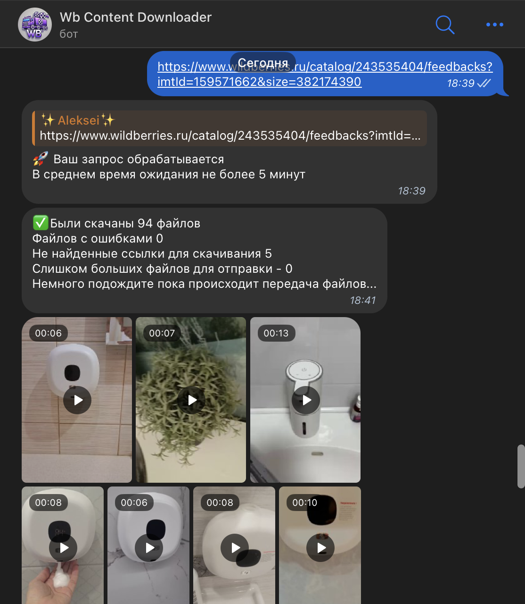

## Wb Content Downloader


## Описание
### Тестовый проект по скачиванию видеороликов из отзывов с известного маркетплейса 
( Selenium + bs4 + aiogram + ffmpeg )



## Структура проекта
```
fast_api_tests.py/
|-- main.py                # основной код работы aiogram + логика работы с отдельными потоками
|-- parse.py               # функции парсинга selenium и чтение кода через bs4
|-- downloader.py          # скачивание и конвертирование видеороликов через ffmpeg_asyncio
|-- common.py              # вспомогательные функции по работе с файлами
|-- config.py              # конфигурация с переменными окружения
|-- downloads/             # папка для скачивания видеороликов
|-- chromedriver           # драйвер для Chrome ()
```
#### \* Для конфигурации необходим файл .env
```
TG_TOKEN={{ токен телеграм бота }}
PROXY_URL={{ url proxy сервера в формате http://URL:PORT }}
BROWSER_PATH={{ глобальный путь до браузера }}
DRIVER_PATH={{ глобальный путь до chromedriver }}
```
\** proxy сервер должен работать в режиме аутентификации по ip

\*** для работы приложения необходимы дополнительные зависимости

- Google Chrome for Testing (134.0.6998.88)
- Xvfb
- FFmpeg
